Login no mininet:

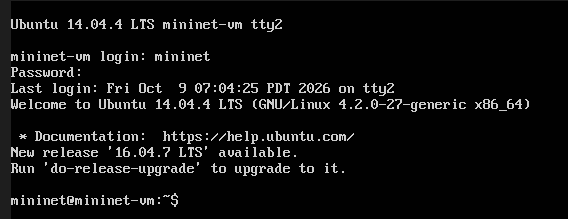

Comando para a criação da rede linear com 6 switches, limitando a largura de banda com 25 Mbps, e padronizando os endereços MAC:

```
sudo mn --topo=linear,6 --link tc,bw=25 --mac
```

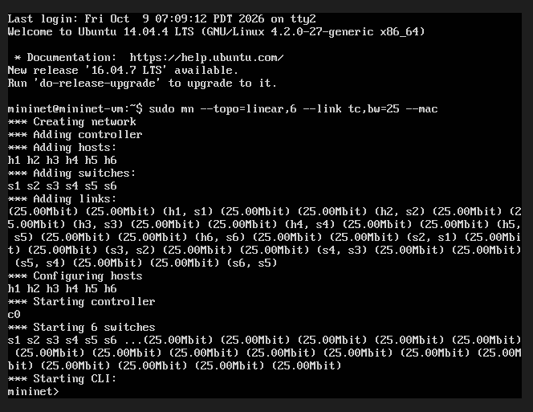

Confirmação dos nós e das conexões:

```
nodes
net
```

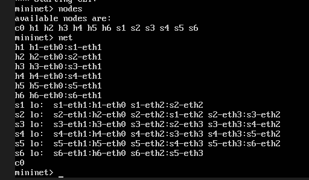

Conferindo as informações de cada nó:

```
dump
```

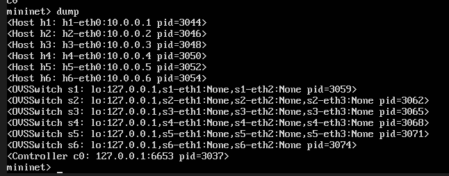

Conferindo os endereços MAC, se estão padronizados mesmo:

```
h1 ifconfig
h2 ifconfig
h3 ifconfig
h4 ifconfig
h5 ifconfig
h6 ifconfig
```

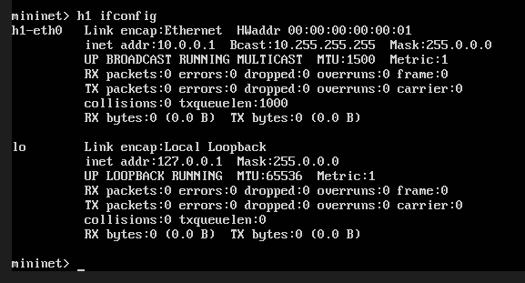
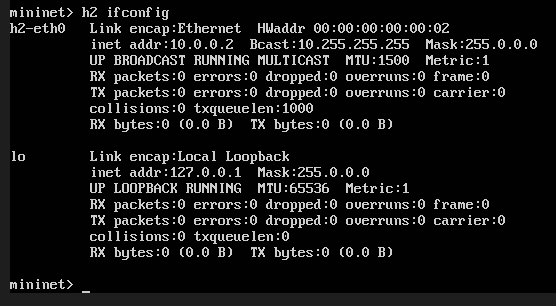
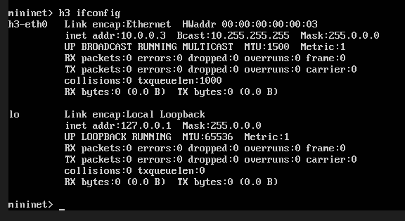
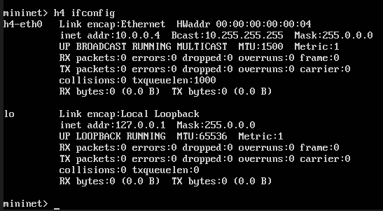

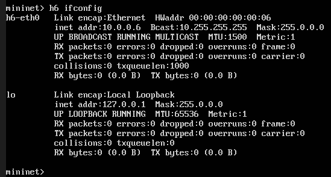

Realizando o teste de ping entre todos os nós:

```
pingall
```

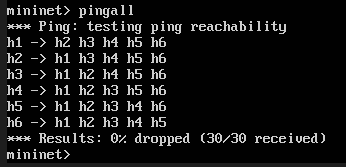

Realizando o ping de h1 para h2, com a contagem de 5:

```
h1 ping -c 5 h2
```

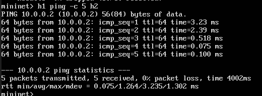

Realizando o ping de h1 para os demais hosts, também com a contagem de 5:

```
h1 ping -c 5 h3
h1 ping -c 5 h4
h1 ping -c 5 h5
h1 ping -c 5 h6
```

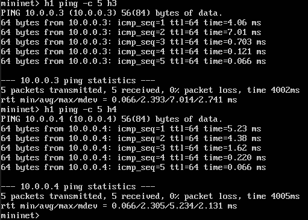
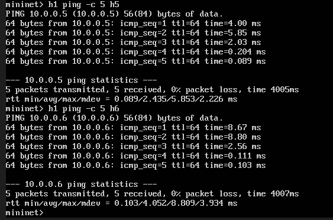

Feita toda a configuração com o Xming e o Putty, abrimos o terminal do Windows para H1 e H2:

```
xterm h1
xterm h2
```

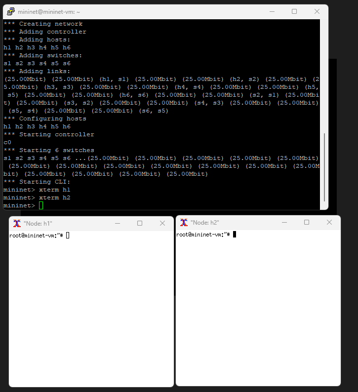

Configurando H1 como servidor TCP na porta 5555, com um relatório por segundo:

```
iperf -s -p 5555 -i 1
```

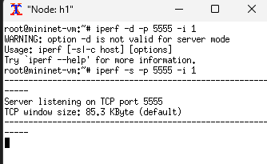

Configurando H2 como cliente, conectando no H1 com um relatório por segundo e teste de 15 segundos:

```
iperf -c 10.0.0.1 -p 5555 -i 1 -t 15
```

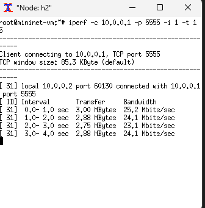

Resultado final do teste:

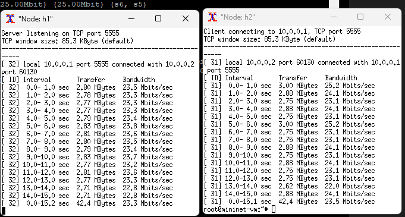
